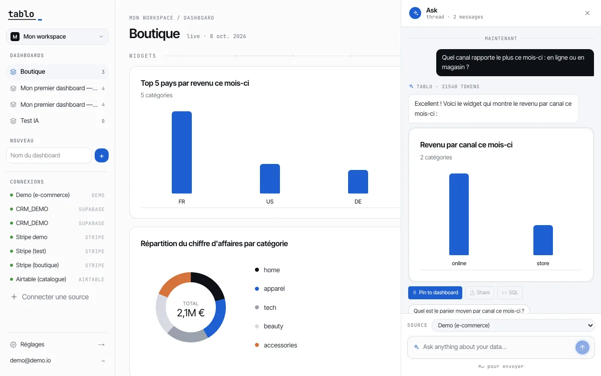
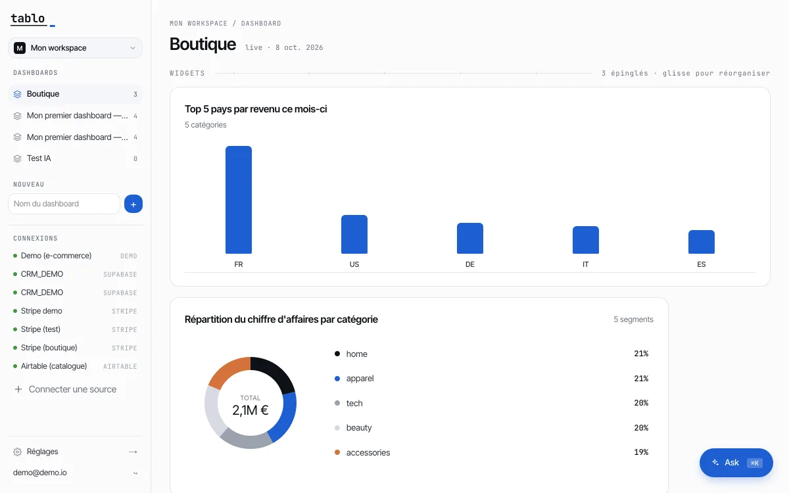
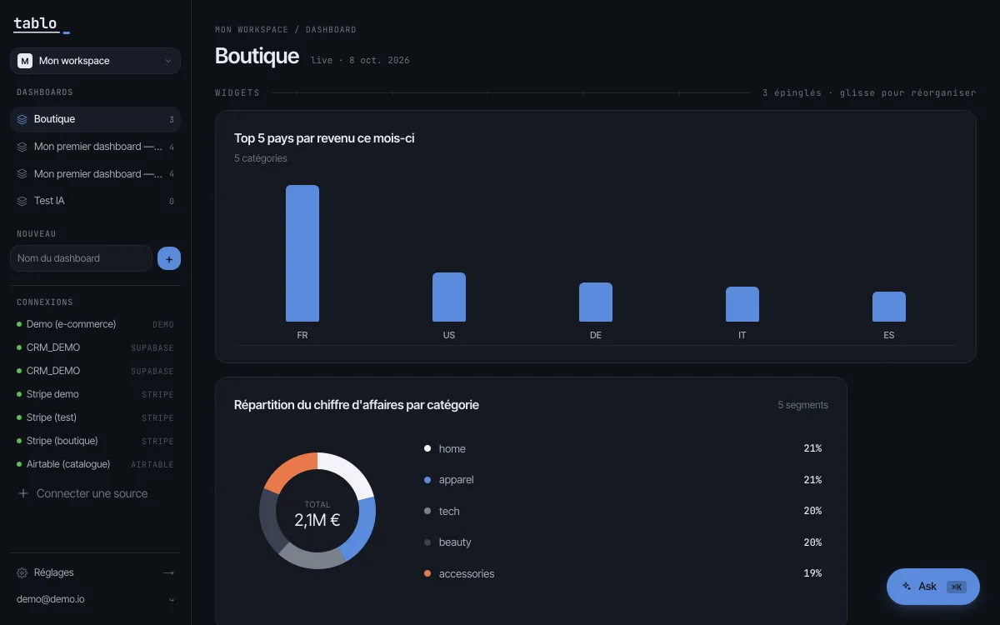
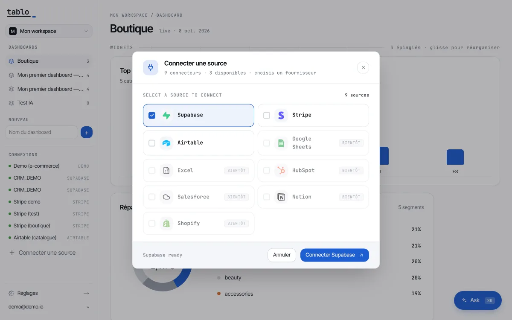
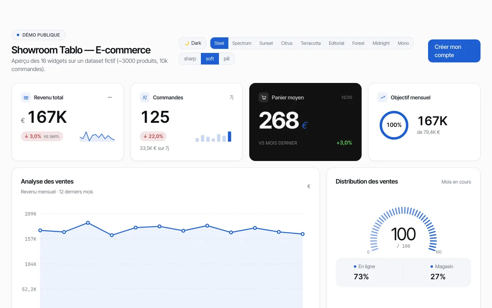
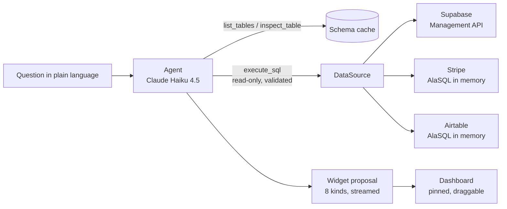

# Tablo

**Connect your data — Supabase, Stripe or Airtable — and ask for a dashboard widget in plain language.**


[](https://github.com/cedricgicquiaud/tablo/actions/workflows/ci.yml)

[](LICENSE)



## Overview

A demo dashboard on made-up numbers is quick to build. Making one hold on real data — a secure connection, read-only
access, the tools a business already uses — is the actual work.

Tablo connects to a source you already have and lets you describe the widget you want: *"Which channel brings in the
most this month: online or in store?"*. An AI agent explores the schema, writes a read-only SQL query, checks the result
and proposes a widget. You pin it to a dashboard and drag it where you want.

It started as a reusable e-commerce dashboard template (16 hand-built widgets, still available as a showroom) and grew
into a dashboard builder on top of real sources. The interface is in French.

| A dashboard built from three questions | Dark mode |
|---|---|
|  |  |

## Features

- **Three sources behind one interface.** Supabase (OAuth, queried through the Supabase Management API), Stripe
  (Stripe Connect Standard) and Airtable (OAuth with PKCE). Every source implements the same `DataSource` interface.
  Stripe and Airtable are queried in SQL in memory (AlaSQL), loading only the tables the query names.
- **Ask in plain language.** The agent (Claude Haiku 4.5) lists tables, inspects columns, runs SQL, then proposes one of
  eight widget kinds: metric card, time series, bar chart, donut, gauge, table, funnel, timeline. Answers stream as
  they are written, and each widget comes with follow-up questions.
- **A schema cache.** After a connection, Tablo profiles the source once. The agent then starts from the cached schema
  instead of exploring it on every question.
- **A starter dashboard.** When you connect a Supabase project, Tablo detects the kind of business (e-commerce, CRM,
  SaaS, finance) and generates four to five starting widgets.
- **Guardrails on every question.** At most 10 agent turns, 3 retries per tool and a $0.05 budget cap; a question that
  goes over stops with an error instead of running on.
- **A showroom of 16 widgets** on a fictional dataset (3,000 products, 10,000 orders), with 9 colour palettes, light and
  dark modes, and three corner styles.

| Connect a source | The 16-widget showroom |
|---|---|
|  |  |

## Getting started

Requires [Bun](https://bun.sh) 1.3 or later, the [Supabase CLI](https://supabase.com/docs/guides/cli) and Docker
(Supabase runs locally in containers).

```bash
git clone https://github.com/cedricgicquiaud/tablo.git
cd tablo
bun install

supabase start                   # local Postgres, Auth and API in Docker
cp .env.example .env.local       # then fill in the values below
supabase db reset                # applies the migrations
bun run db:seed                  # fictional e-commerce data + the demo account
bun run dev                      # http://localhost:3000
```

Sign in with `demo@demo.io` / `demodemo`. The showroom is at `/demo`.

Fill in `.env.local`:

| Variable | Where it comes from |
|---|---|
| `NEXT_PUBLIC_SUPABASE_URL`, `NEXT_PUBLIC_SUPABASE_ANON_KEY`, `SUPABASE_SERVICE_ROLE_KEY` | `supabase status` |
| `CONNECTOR_ENCRYPTION_KEY` | `openssl rand -hex 32` — encrypts the OAuth tokens of connected sources |
| `ANTHROPIC_API_KEY` | [console.anthropic.com](https://console.anthropic.com/settings/keys) — needed for Ask |

The demo source works without any OAuth app. To connect your own Supabase, Stripe or Airtable, see
[Connecting your own sources](#connecting-your-own-sources).

| Command | What it does |
|---|---|
| `bun run dev` | Next.js dev server (Turbopack) |
| `bun run test` | Unit tests (Vitest) — run in CI on every pull request |
| `bun run test:integration` | Database tests — need local Supabase, not run in CI |
| `bun run typecheck` | `tsc --noEmit` |
| `bun run lint` | ESLint |
| `bun run build` | Production build |
| `bun run db:seed` | Regenerates the fictional data (deterministic) |
| `bun run db:types` | Regenerates the database types from the local schema |

Use `bun run test`, not `bun test`: the latter starts Bun's own test runner, not Vitest.

## Connecting your own sources

Each source needs an OAuth app registered on the provider's side, with the redirect URI
`http://localhost:3000/oauth/<provider>/callback`.

- **Supabase** — create an OAuth app in your Supabase organisation
  ([guide](https://supabase.com/docs/guides/integrations/build-a-supabase-oauth-integration)), then set
  `SUPABASE_OAUTH_CLIENT_ID`, `SUPABASE_OAUTH_CLIENT_SECRET` and `SUPABASE_OAUTH_REDIRECT_URI`.
- **Stripe** — in test mode, *Settings → Connect → Standard accounts*, add the redirect URI, then set
  `STRIPE_CONNECT_CLIENT_ID` (`ca_test_…`) and `STRIPE_SECRET_KEY` (`sk_test_…`).
- **Airtable** — register an integration at [airtable.com/create/oauth](https://airtable.com/create/oauth) with the
  scopes `data.records:read schema.bases:read user.email:read`, then set `AIRTABLE_OAUTH_CLIENT_ID`,
  `AIRTABLE_OAUTH_CLIENT_SECRET` and `AIRTABLE_OAUTH_REDIRECT_URI`.

## Architecture




Key decisions:
- **Read-only by construction.** Every query goes through a validator before it reaches a source: comments and string
  literals are stripped, only `SELECT` and `WITH` are accepted, and a second statement is refused.
- **The database refuses what you may not read.** Row-level security is enabled on every table of the app (26 policies
  over 14 tables), and the browser never writes directly.
- **Secrets stay on the server.** OAuth tokens are encrypted in the database (AES-256-GCM). The Supabase service-role
  key and the Anthropic key are only read by server code.
- **One interface for every source.** Adding a connector means implementing `DataSource`; the agent and the widgets do
  not change.

<details>
<summary>Project structure</summary>

```
src/app/          routes: /app (dashboards), /demo (showroom), /login, /signup, OAuth callbacks
src/lib/ai-engine agent loop, tools, schema cache, streaming
src/lib/connectors Supabase, Stripe, Airtable, demo; SQL validation; token refresh
src/lib/tablo/    starter dashboard: business detection, layout
src/components/   widgets, dashboard grid, Ask panel
supabase/         migrations (schema, RLS policies, RPCs)
scripts/          seed and benchmarks
docs/screenshots/ the images of this README
```

</details>

## Status

Works locally: 437 unit tests, strict typing, CI on every pull request. Not deployed yet.

Roadmap:
- **A hosted demo** on fictional data, so the app can be tried without installing it.
- **More sources** — Google Sheets, Excel, HubSpot, Salesforce, Notion and Shopify are listed as "coming soon".
- Global date filters that apply to every widget of a dashboard.

## License

[MIT](LICENSE). Part of the AI engine is adapted from [Nao](https://github.com/getnao/nao) (Apache License 2.0); see
[NOTICE.md](NOTICE.md). Independent project, not affiliated with Anthropic, Supabase, Stripe or Airtable.
